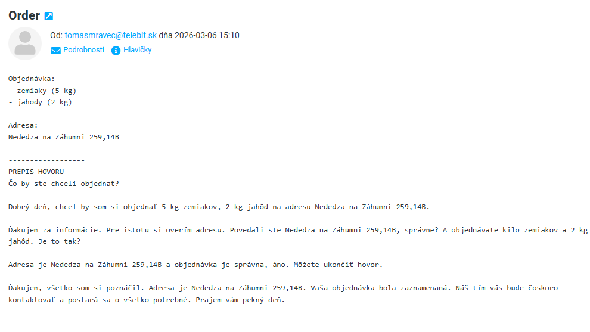

# AI Order Processing Service

This service processes incoming phone calls handled by GoHighLevel AI agents.  
After a call finishes, a webhook triggers this application to retrieve the call recording, transcribe it, extract order information, and send the result by email.

## Flow

1. A customer calls a company phone number.
2. The call is handled by a GoHighLevel AI Voice Agent.
3. After the call ends, a workflow sends a webhook to this service.
4. The service:
   - retrieves the call recording from GoHighLevel
   - transcribes the audio
   - extracts order details using OpenAI
   - sends the order and transcription to email.

## Architecture

Main components:

- `OrderProcessingController`  
  Webhook endpoint that receives notifications from GoHighLevel.

- `VoiceRecordingRetriever`  
  Retrieves the latest call recording using `locationId` and `contactId`.

- `GhlClient`  
  HTTP client for GoHighLevel API calls.

- `RecordingTranscriber`  
  Interface for audio transcription.

- `OpenAiRecordingTranscriber`  
  Implementation using OpenAI transcription API.

- `OrderProcessor`  
  Interface for extracting order data from text
- `OpenAiOrderProcessor`  
  Uses OpenAI to extract items and address from the transcription.

- `OrderPresenter`  
  Formats the extracted order and sends it via email.

- `EmailService`  
  Sends email using SMTP.

## Example Email

Example of the email generated after processing an order:

